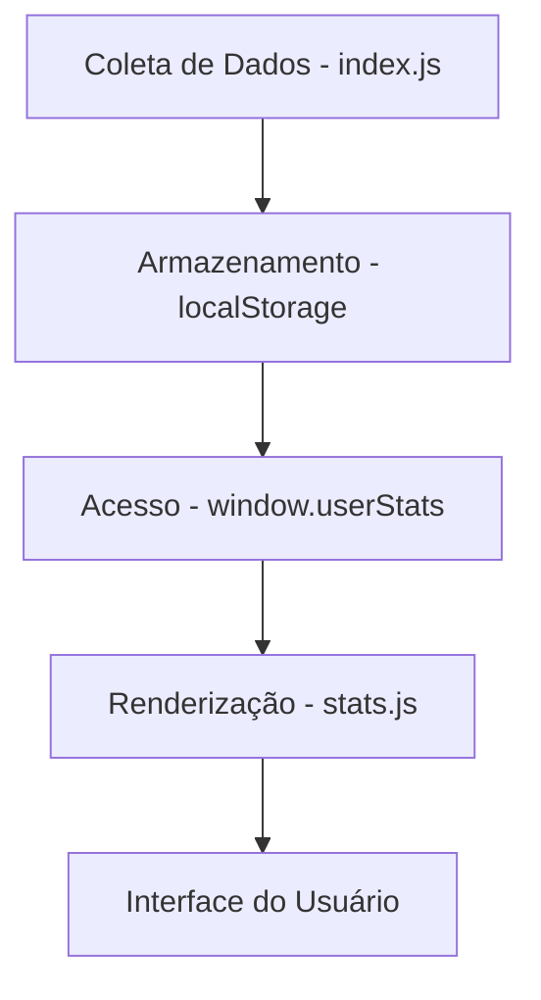

# Refatoração do Painel de Estatísticas

## 1. Visão Geral

### 1.1 Objetivo
Refatorar completamente o painel de estatísticas para oferecer uma visualização mais rica, dinâmica e informativa dos dados de uso do aplicativo. O novo painel deve incluir mais métricas, gráficos interativos e uma interface mais intuitiva.

### 1.2 Escopo
- Reestruturação da interface do painel de estatísticas
- Adição de novas métricas e visualizações
- Implementação de gráficos interativos
- Melhoria na organização e apresentação das informações
- Adição de recursos de personalização e filtros avançados
- Melhoria na responsividade e experiência do usuário
- Implementação de notificações e alertas personalizáveis
- Adição de funcionalidades de compartilhamento de dados

## 2. Arquitetura Atual

### 2.1 Componentes Existentes
- `stats.js`: Responsável pela interface e renderização do painel
- `index.js`: Gerencia a coleta e armazenamento das estatísticas
- `window.userStats`: Objeto global que armazena as métricas

### 2.2 Fluxo de Dados

### 2.3 Limitações do Sistema Atual
- Interface estática com poucas opções de personalização
- Visualizações limitadas a gráficos de barras simples
- Falta de filtros e ordenações avançadas
- Atualização automática fixa de 60 segundos
- Exportação limitada apenas ao formato JSON

## 3. Novo Design do Painel

### 3.1 Estrutura de Navegação
- Abas para diferentes categorias de estatísticas
- Menu lateral para navegação rápida
- Barra de filtros para personalização da visualização

### 3.2 Métricas Principais
- Visitas totais e diárias
- Lives abertas/fechadas
- Tempo total assistido (geral e por canal)
- Canais favoritos
- Canais mais assistidos
- Picos de uso (horários de maior atividade)
- Taxa de retenção de canais
- Tempo médio por sessão
- Taxa de retorno de canais
- Comparação de desempenho entre diferentes tipos de canais

### 3.3 Visualizações
- Gráficos de barras para comparação de tempo assistido
- Gráficos de linha para histórico de uso
- Gráficos de pizza para distribuição percentual
- Tabelas interativas com ordenação e filtragem
- Cards de destaque para métricas importantes
- Mapa de calor para horários de pico de uso
- Gráficos de área para visualização cumulativa
- Diagramas de dispersão para correlações entre métricas

## 4. Componentes do Novo Painel

### 4.1 Cabeçalho
- Título do painel
- Data e hora da última atualização
- Botão de atualização manual
- Botão de exportação de dados

### 4.2 Abas de Navegação
- Visão Geral
- Tempo Assistido
- Canais Favoritos
- Histórico de Uso
- Configurações

### 4.3 Seção de Visão Geral
- Cards de métricas principais com valores e tendências
- Gráfico de resumo do uso semanal
- Lista dos canais mais assistidos recentemente
- Indicador de desempenho em comparação com o período anterior

### 4.8 Barra de Status
- Indicador de desempenho do sistema
- Mensagens de feedback para o usuário
- Indicador de carregamento de dados
- Notificações de alertas e lembretes

### 4.4 Seção de Tempo Assistido
- Gráfico de barras comparando tempo assistido por canal
- Tabela detalhada com tempo por canal
- Filtros por tipo de canal (premium, plus, etc.)
- Comparação com período anterior
- Gráfico de linha mostrando evolução do tempo assistido ao longo do tempo
- Indicadores de tendência e comparação percentual
- Classificação de canais por tempo assistido

### 4.5 Seção de Canais Favoritos
- Lista de canais favoritos com estatísticas individuais
- Gráfico de pizza mostrando distribuição de favoritos
- Histórico de favoritamento/desfavoritamento
- Comparação entre canais favoritos e tempo assistido
- Análise de padrões de favoritamento ao longo do tempo

### 4.6 Seção de Histórico de Uso
- Gráfico de linha mostrando uso ao longo do tempo
- Tabela com histórico detalhado de ações
- Filtros por data e tipo de ação
- Visualização de tendências de uso por período

### 4.7 Seção de Configurações
- Opções de personalização do painel
- Configurações de exportação de dados
- Preferências de visualização
- Configurações de intervalo de atualização automática
- Configurações de notificações e alertas
- Opções de compartilhamento de dados

## 5. Funcionalidades Adicionais

### 5.1 Atualização em Tempo Real
- Atualização automática com intervalo configurável (mínimo de 30 segundos)
- Indicador visual de atualização em andamento
- Opção para desativar atualização automática

### 5.2 Filtros e Pesquisa
- Filtros por data (hoje, semana, mês, ano, personalizado)
- Pesquisa por nome de canal
- Filtros por tipo de canal
- Ordenação por diferentes métricas

### 5.3 Exportação de Dados
- Exportação em JSON (mantendo a funcionalidade existente)
- Nova opção de exportação em CSV
- Exportação de gráficos como imagens
- Opção para exportar dados filtrados

### 5.4 Responsividade
- Design adaptável para diferentes tamanhos de tela
- Layout otimizado para dispositivos móveis
- Comportamento responsivo dos gráficos

### 5.5 Notificações e Alertas
- Notificações para picos de uso incomum
- Alertas para canais que não são assistidos há muito tempo
- Lembretes para exportação regular de dados

### 5.6 Compartilhamento de Dados
- Opção para compartilhar resumos de estatísticas
- Integração com redes sociais para compartilhamento
- Geração de links públicos para relatórios

## 6. Tecnologias e Bibliotecas

### 6.1 Bibliotecas de Visualização
- Chart.js para gráficos interativos (escolhido por seu equilíbrio entre facilidade de uso e recursos avançados)
- DataTables para tabelas com filtragem e ordenação

### 6.2 Framework CSS
- Tailwind CSS (mantendo a consistência com o projeto existente)

### 6.3 Componentes Reutilizáveis
- Componentes de card para métricas
- Componentes de gráfico reutilizáveis
- Componentes de filtro e pesquisa

### 6.4 Considerações de Desempenho
- Otimização de renderização de gráficos para grandes volumes de dados
- Implementação de paginação em tabelas com muitos registros
- Uso de técnicas de lazy loading para carregamento sob demanda

### 6.5 Considerações de Acessibilidade
- Implementação de atributos ARIA para leitores de tela
- Contraste adequado de cores para usuários com deficiências visuais
- Navegação por teclado para usuários que não utilizam mouse

## 7. Integração com Sistema Existente

### 7.1 Acesso aos Dados
- Continuar utilizando `window.userStats` como fonte principal
- Manter compatibilidade com o sistema de armazenamento existente
- Adicionar novas métricas ao objeto existente quando necessário

### 7.2 Eventos e Atualizações
- Integrar com o sistema de atualização existente
- Manter os intervalos de atualização configuráveis
- Garantir que as novas funcionalidades não impactem o desempenho geral

### 7.3 Compatibilidade
- Garantir retrocompatibilidade com versões anteriores do formato de dados
- Manter funcionamento adequado em navegadores modernos
- Assegurar funcionamento em dispositivos com diferentes capacidades de processamento

### 7.4 Segurança
- Proteger dados sensíveis do usuário
- Implementar práticas de privacidade adequadas
- Garantir que a exportação de dados seja segura
- Validar entradas do usuário para prevenir ataques XSS

### 7.5 Manutenção
- Documentação abrangente para futuras expansões
- Código modular para fácil manutenção
- Estratégia de versionamento para atualizações

## 8. Testes

### 8.1 Testes Unitários
- Testar funções de formatação de dados
- Validar cálculos de métricas
- Verificar renderização de componentes

### 8.2 Testes de Interface
- Verificar responsividade em diferentes tamanhos de tela
- Testar interações com gráficos e tabelas
- Validar funcionamento dos filtros e ordenações

### 8.3 Testes de Integração
- Garantir que os dados sejam carregados corretamente
- Verificar atualização automática das métricas
- Testar exportação de dados em diferentes formatos
- Validar funcionamento responsivo em dispositivos móveis
- Verificar compatibilidade com diferentes navegadores

### 8.4 Testes de Usabilidade
- Avaliar a intuitividade da interface
- Verificar acessibilidade para usuários com deficiências
- Testar experiência do usuário em diferentes cenários de uso

### 8.5 Testes de Desempenho
- Medir tempo de carregamento do painel
- Verificar consumo de memória com grandes volumes de dados
- Avaliar responsividade em dispositivos com diferentes capacidades